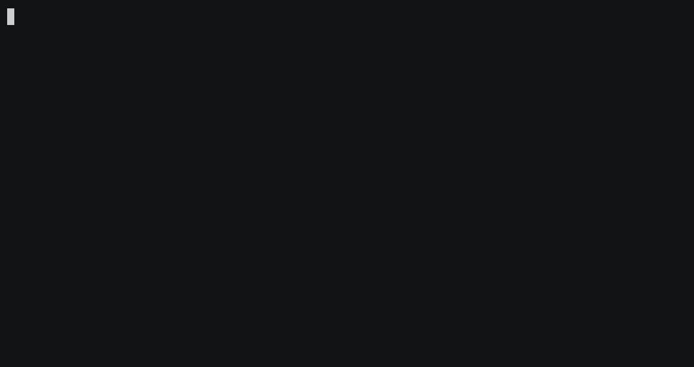

# Sokoban

A command-line sokoban game, features a state-space A* solver with simple deadlock detection.



## How to play

```fish
cargo run --release
```

- Use `q` to go back to previous screen
- Use arrow keys to move
- In game screen, press `o` to start solver

## Benchmarking

```fish
cargo bench
```

## Profiling

```fish
CARGO_PROFILE_BENCH_DEBUG=true cargo flamegraph --bench solver_benchmark
```

## Experimental solver features

### Freeze deadlock detection

Freeze deadlock detection was implemented but not enabled by default, as the decrease in the number of visited states, while reducing runtime, did not sufficiently offset the additional overhead it introduced. You may run the game with `cargo r --release --features freeze_deadlock_check`. In `levels/cognitive/4.txt`, it reduced number of visited state from `117885` to `110204`. The implementation is available in function `Solver::check_freeze_deadlock_wrap` in `src/game/solver.rs`.

### Bi-directional A* search

There doesn’t seem to be anyone who has implemented this, so I gave it a try. It turns out it visits more states than A*, and due to more clones in state, has larger overhead. This means it's much slower than A*. If you're interested in looking into it in detail (don't do it, it's a total mess), go `git checkout bi_a_star` and take a look at `src/game/solver.rs`.

## Planned features / experiments

- [ ] Add undo
- [ ] Abstract out backend
  - [ ] Add align in the middle
  - [ ] Add wrapping (to handle cases for too many levels in level selector, for example)
  - [ ] Add crossterm backend
  - [ ] Add WASM backend
- [ ] Abstract out solver algo framework to make them swapable
  - [ ] Implement ID-A*
- [ ] Make solver multi-threaded
